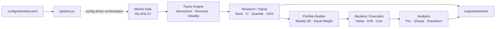

# AlphaForge — 横截面量化研究与回测引擎

AlphaForge 是一个 Python-first 的 A 股横截面量化研究与回测引擎，覆盖从 Market Data、Factor Research、Portfolio Construction 到 Execution、PnL 与 Analytics 的完整工作流，重点关注 Quant correctness、工程边界与可复现实验。清晰、可解释的模块与 timing semantics 也使其能够支持 Quant Developer 技术面试中的 project deep dive。

项目遵循 **Correctness > Return**。Frozen baseline 的用途不是寻找或包装高收益策略，而是建立一条 timing 明确、能够讨论 bias / cost / execution assumptions、并适合在技术面试中逐层解释的研究与回测链路。目标岗位包括 Strategy / Research Quant Developer、Research Platform 与 Backtest / Data Infra Quant Developer。

## 核心流程与架构



核心逻辑位于 `src/alphaforge/`，`pipeline.py` 只负责按 config 串联既有模块。Research、portfolio 与 backtest 共用同一套 factor、quantile、execution 和 accounting semantics，避免不同实验各自实现一套口径。

## Baseline Strategy

Frozen baseline 固定如下，不根据后续 OOS、cost sensitivity 或 factor combination 结果反向调参：

其中，`momentum_20d` 的 higher-is-better direction 是 ex-ante frozen definition；不会根据 realized IC、Sharpe 或 OOS results 事后 flip direction，以避免 data snooping。

| 项目 | 定义 |
|---|---|
| Universe | CSI300 current-membership snapshot，snapshot date 为 `2026-08-14`，共 300 symbols |
| Market data | 2021-01-04 至 2025-12-31 日频 OHLCV；研究价格使用 `hfq` 后复权数据 |
| Factor candidates | `momentum_20d`、`reversal_5d`、`volatility_20d` |
| Baseline factor | `momentum_20d = close(t) / close(t-20) - 1` |
| Portfolio | Long only，top quintile / Q5，equal weight |
| Rebalance | 每个 calendar week 的最后一个 global trading date 生成 decision |
| Execution | Decision 后的 next global trading-date close |
| Friction | 5 bps transaction cost + 5 bps slippage，按 gross traded stock weight 线性计提 |

另外两个基础 Factor 分别是 5-observation trailing return 的相反数 `reversal_5d`，以及 20-observation daily return sample volatility `volatility_20d`。所有 rolling window 都按单个 symbol 的 available observations 计算。

Timing boundary 明确写成：

```text
factor(t)
→ signal(t) / target_weight(t)
→ execution(next global trading-date close)
```

`target_weight` 是 decision 时的目标配置，不是之后每天的 actual portfolio weight。上一日 post-trade weights 先承担当日 close-to-close return 并漂移为 pre-trade weights；只有存在 delayed execution event 时，组合才从 pre-trade weights 交易到上一 global trading date 的 target。Carry-forward target 不等于每日重新 equal weight。

## Correctness & Timing 设计

- **No look-ahead**：`factor(t)` 只使用截至 `t` 的历史 observation；当日 close 形成的 target 到下一 global trading-date close 才执行，新仓位不获得执行前已经发生的收益。
- **Cross-sectional / time-series 分离**：Factor 与 forward return 按 symbol、按时间计算；rank、quantile、Spearman IC 与 factor correlation 按 date 做横截面计算，不把全历史 observations 混在一起排序。
- **Factor / return alignment**：Forward return 保持对齐 formation row；OOS research label 在每个 chronological period 内单独计算，不跨 period boundary 取未来价格。
- **Actual weight drift**：Backtest 显式记录 `pretrade_weight`、`trade_weight` 与 `posttrade_weight`。Scheduled rebalance 从漂移后的 actual weights 出发，而不是从上一次 target 出发。
- **Turnover / cost accounting**：Turnover 使用包含 cash leg 的 half-L1；transaction cost 与 slippage 使用 gross stock traded weight。`net_return = (1 + gross_return) × (1 - total_cost) - 1`，NAV 再逐日复利。
- **Unbalanced panel**：Data Layer 不补 synthetic OHLCV rows。估值使用 past-only forward-filled close；缺失 observation 当日 marked return 为 0，下次真实 close 出现时一次体现累计价格变化。
- **Chronological OOS**：Factor 先在完整历史上按 past-only semantics 计算，以保留 OOS 起点的合法 lookback；strategy backtest 连续运行，不在 IS / OOS boundary 清仓或重置状态。
- **Frozen definitions**：Baseline factor、portfolio、execution 与 cost assumptions 在 robustness analysis 前固定；后续结果只用于描述和压力测试，不用于 data snooping。

Tests 聚焦 timing、alignment、no look-ahead、portfolio invariants、weight drift、turnover / cost、NAV、period boundary 与 missing-data semantics，而不是追求形式化 coverage 数字。

## Baseline Results

以下结果来自仓库中已提交的 `outputs/baseline/` production artifacts。除特别说明外，strategy results 均使用 frozen portfolio、5 + 5 bps friction、252 periods annualization 和 zero risk-free rate。

| Metric | Frozen Momentum Baseline |
|---|---:|
| Annualized return | 11.3505% |
| Annualized volatility | 24.3017% |
| Sharpe | 0.5635 |
| Max drawdown | -35.6364% |
| Cumulative return | 67.7131% |
| Ending NAV | 1.6771 |
| Total turnover | 93.6218× |
| Annualized turnover | 19.4659× |

**Observed result：** 在当前数据与模型假设下，baseline ending NAV 为 `1.6771`，但 total turnover 很高，最大回撤超过 35%。

**Interpretation：** 该结果证明的是 end-to-end workflow 能以统一口径完成 signal 到 PnL 的计算，不是稳定或可交易 alpha 的证据。Full-sample factor IC 较弱且 quantile profile 并不单调。

**Limitation：** 所有数值都继承 current-membership universe、adjusted research price 与理想化 execution 的限制，不能直接解释为可实现的历史交易收益。

## Research Robustness

Robustness analysis 固定使用原始 Factor 定义，覆盖：

- `1 / 2 / 5 / 10` available-observation forward horizons；
- `0 / 1 / 2 / 3 / 4 / 5 / 10` lag 的 factor decay；
- 2021–2025 yearly IC stability；
- IS 2021–2023、OOS 2024、OOS 2025 的 chronological evaluation；
- equal-weight rank / z-score factor combination。

Production observation 显示，`reversal_5d` 的 mean IC 从 lag 0 的 `0.02155` 快速下降到 lag 4–5 的约 `0.0017–0.0019`，呈现明显 short-horizon decay；`volatility_20d` 的 negative rank association 在 lag 0–10 较为持续；`momentum_20d` 则是 weak / noisy negative association。三个 Factor 的 yearly mean IC sign 在 2021–2025 保持一致，但 magnitude 明显 time-varying。

Frozen baseline 的 chronological strategy summary 为：

| Period | Annualized return | Sharpe | Cumulative return | Total turnover |
|---|---:|---:|---:|---:|
| IS 2021–2023 | -2.4579% | 0.0028 | -6.9278% | 55.8263× |
| OOS 2024 | 20.6151% | 0.8072 | 19.7213% | 19.6198× |
| OOS 2025 | 52.8102% | 1.8079 | 50.5135% | 18.1758× |

**Interpretation：** OOS 高于 IS 只说明同一 frozen rule 在不同年份表现差异显著，不能据此推断未来稳定性，也没有据此修改 baseline。Period analytics 从连续 backtest 中切片并在各 period 内把 return stream rebased to NAV 1；底层 position 与 execution state 不重置。

## Cost Sensitivity

| Total friction | Annualized return | Sharpe | Cumulative return | Ending NAV |
|---:|---:|---:|---:|---:|
| 0 bps | 15.7488% | 0.7223 | 102.0614% | 2.0206 |
| 10 bps — frozen baseline | 11.3505% | 0.5635 | 67.7131% | 1.6771 |
| 50 bps | -4.6627% | -0.0757 | -20.5188% | 0.7948 |

**Observed result：** 不同 friction assumptions 不改变 trading / turnover path；10 bps 已使 ending NAV 从 zero-cost 的 `2.0206` 降至 `1.6771`，50 bps 下累计收益转负。

**Interpretation：** 这是 high-turnover strategy 对 transaction friction 敏感的直接证据。当前 cost 与 slippage 采用相同的线性数学形式，因此结果是 sensitivity analysis，不是完整的可交易性模型。

## Factor Combination

`combined_rank` 与 `combined_zscore` 将方向预先确定的三个 Factor 做严格 equal-weight combination：Momentum 与现有 Reversal 定义取正向，Volatility 取负向；任一 input 缺失时 composite 保持 NaN。两种组合都是 experimental，frozen momentum baseline 不变。

| Strategy | Annualized return | Volatility | Sharpe | Max drawdown | Total turnover |
|---|---:|---:|---:|---:|---:|
| Momentum baseline | 11.3505% | 24.3017% | 0.5635 | -35.6364% | 93.6218× |
| Combined Rank | 10.3922% | 15.9142% | 0.7008 | -23.0862% | 142.7879× |
| Combined Z-score | 9.5187% | 15.5223% | 0.6633 | -24.1685% | 133.4754× |

**Observed result：** Combination 没有提高 absolute return，但降低了 volatility 与 drawdown，并提高 Sharpe；代价是 turnover 明显上升。Rank 与 z-score 的风险收益结论接近。

**Interpretation：** 结果更适合作为 signal diversification 与 normalization trade-off 的案例，而不是“发现强 alpha”。Factor weights、directions 与 baseline 均未根据这些结果调整。

## 项目结构

```text
src/alphaforge/
├── data/          # ingestion、schema、quality 与 canonical loader
├── factors/       # Momentum、Reversal、Volatility
├── research/      # rank、IC、quantile、OOS、decay、combination
├── portfolio/     # weekly Q5 signal 与 target weights
├── backtest/      # delayed execution、drift、cost、return / NAV
├── analytics/     # performance metrics 与 cost analysis
└── pipeline.py    # config-driven orchestration

configs/           # frozen baseline 与 universe snapshot
scripts/           # pipeline 和独立 research runners
tests/             # quant correctness tests
outputs/baseline/  # versioned production artifacts
```

## 如何运行

环境要求为 Python 3.12+ 与 [uv](https://docs.astral.sh/uv/)。Canonical dataset 已位于 config 指定的 `data/processed/ohlcv_hfq.parquet`。

运行完整 baseline：

```bash
uv run python scripts/run_pipeline.py
```

运行测试：

```bash
uv run pytest
```

按需重跑主要 research analysis：

```bash
uv run python scripts/run_research_robustness.py
uv run python scripts/run_out_of_sample.py
uv run python scripts/run_cost_analysis.py
uv run python scripts/run_factor_combination.py
```

所有 runner 默认读取 `configs/baseline.toml`，并以稳定文件名覆盖对应 artifacts；experiment runner 不修改 canonical baseline config。

## Outputs

| Artifacts | 内容 |
|---|---|
| `performance.json`、`daily_backtest.parquet` | Baseline metrics、daily return / cost / turnover / NAV |
| `factor_research.csv` | 三个基础 Factor 的 IC、ICIR 与 Q5−Q1 summary |
| `research_horizons.csv`、`factor_decay.csv`、`yearly_ic_stability.csv` | Multi-horizon、decay 与 yearly stability |
| `oos_factor_research.csv`、`oos_performance.csv` | Chronological IS / OOS results |
| `cost_sensitivity.csv`、`turnover_summary.csv` | Friction scenarios 与 trading intensity |
| `factor_combination_research.csv`、`factor_combination_strategy.csv` | Rank / z-score combination 对比 |

全部文件位于 [`outputs/baseline/`](outputs/baseline/)，可直接检查 README 中使用的 production results。

## Known Limitations

- **Survivorship / membership bias**：2021–2025 历史研究使用 2026-08-14 的 frozen current-membership CSI300 snapshot，不是 point-in-time universe；数据源还可能把当前 ticker identifier 回填到历史 observation。
- **Adjusted price 不是 quoted price**：`hfq` OHLC 用于减少 corporate action 的机械跳变，但不是当时市场真实可成交的 nominal quote。
- **Execution 较理想化**：Backtest 假设可在 next global-date 的 past-only marked close 成交。没有模拟 suspension 无法成交、limit up/down、bid/ask、volume participation、liquidity 或 market impact。
- **Missing-data marking 不是 tradability model**：缺失 observation 当日以 0 marked return 估值，下次真实 close 一次体现累计变化；forward fill 只用于 valuation，不代表当日可交易。
- **Observation horizon**：Factor windows、forward horizons 与 decay lags 使用每个 symbol 的 available observations，不等同于 strict exchange-calendar sessions。
- **Overlapping labels**：Longer-horizon forward returns 会重叠，daily IC observations 并非完全 independent；当前 ICIR 仅作 descriptive metric，不是严格显著性检验。
- **OOS 不是永久 holdout**：2024 / 2025 是 frozen-rule 的 retrospective chronological evidence，后续 factor combination research 已再次查看这些 periods，因此不是 permanently untouched final holdout。

## 后续计划

Week 1–2 Resume-Ready MVP 已完成。下一阶段从 profiling 开始：先记录 Python CPU / memory baseline，再针对真实 bottleneck 做 NumPy / vectorization 等优化；只有 profiling 证明 hot path 值得迁移时，才引入 C++17 / pybind11。当前不宣称 C++ 优化已经完成。
